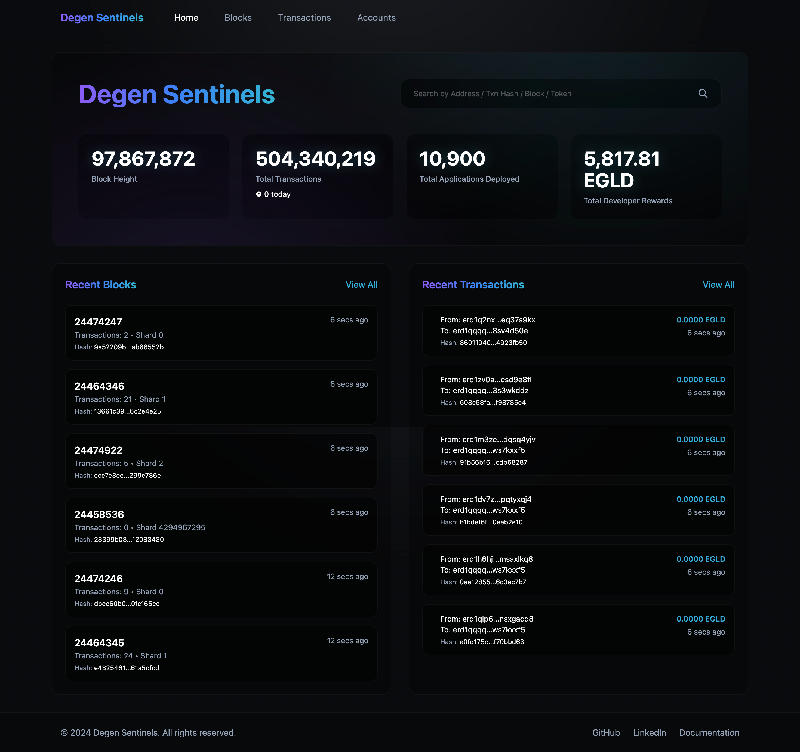
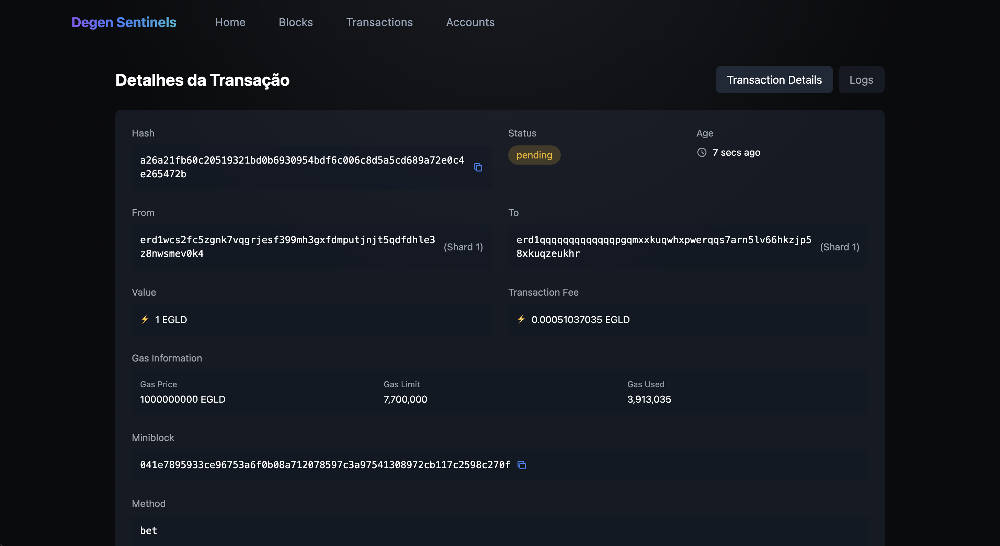

# Degen Sentinels - MultiversX Block Explorer



A modern and intuitive blockchain explorer developed for the MultiversX network. This project was born during the NearX x MultiversX Hackathon with the goal of providing a robust and user-friendly tool for exploring blockchain data.

## Tech Stack

- React 18 for building the interface
- Node.js for development environment and package management
- TypeScript for type safety and better development
- Tailwind CSS for modern and responsive styling
- React Query for state management and caching
- MultiversX API for blockchain integration

## Features

- Real-time transaction monitoring
- Detailed transaction information including status, value, gas, and smart contract data
- Block exploration and information
- Account search and visualization
- Dark mode interface optimized for better user experience

## Development Environment

- Node.js v18+
- npm for dependency management
- Vite as bundler and development server
- ESLint and Prettier for code standardization

## Getting Started

1. Clone the repository
```bash
git clone https://github.com/yourusername/multiversx-block-explorer.git
cd multiversx-block-explorer
```

2. Install dependencies
```bash
npm install
```

3. Start the development server
```bash
npm run dev
```

4. Build for production
```bash
npm run build
```

## Screenshots

### Home Page


### Transaction Details


## Contributing

Feel free to contribute to this project by opening issues or submitting pull requests.

## License

This project is licensed under the MIT License - see the [LICENSE](LICENSE) file for details.

## Acknowledgments

Special thanks to NearX and MultiversX for the opportunity to participate in this amazing hackathon!